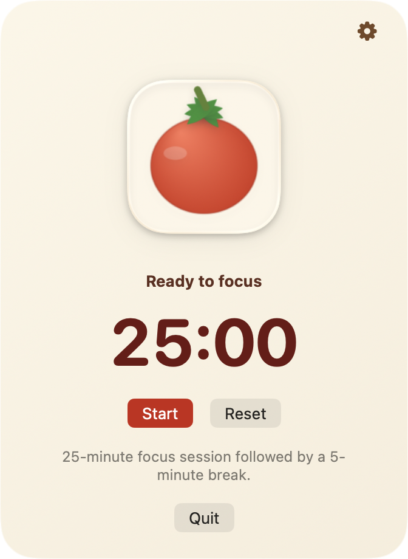

# Pomodoro Timer

Simple macOS Pomodoro timer that lives as a system menu bar icon.

## Overview

Pomodoro Timer sits in the macOS menu bar as a tomato icon. Click the icon to open the dropdown timer, pick a quick session preset on the main screen, start a focus session, adjust your focus and break lengths, and reset whenever you want.

By default the app stays out of the Dock. If your menu bar is too full and the tomato icon is not accessible, launch the app again to open the fallback window in front. Closing that fallback window removes the Dock icon again.

The app shows popup alerts when a focus session or break ends. After a focus session ends, the break timer waits until you acknowledge the popup.

If you want to turn on the Do Not Disturb during focus setting, you need to set up two Shortcuts named `Pomodoro Enable DND` and `Pomodoro Disable DND`. If they are missing or broken, the timer still runs normally and Pomodoro shows a setup reminder.

## Screenshot



## What You Can Do

- pick `25+5`, `35+10`, or `50+15` directly from the main timer screen
- start and reset the timer directly from the dropdown
- choose your preferred focus length
- choose your preferred break length
- keep the timer accessible from the menu bar
- optionally play a gentle sound when a session ends
- optionally run Do Not Disturb during focus with Shortcuts

## Keyboard Shortcuts

- `Space` to start
- `Tab` to cycle quick presets on the timer page
- `Shift+Tab` to cycle quick presets backward
- `Left Arrow` and `Right Arrow` to move between quick presets
- `Esc` to leave settings or dismiss the timer surface
- `R` to reset
- `Cmd+,` to open settings

## Settings

You can change:

- focus length
- break length
- sound on or off
- Do Not Disturb during focus, with two required Shortcuts

The main timer screen also includes one-click quick presets for `25` minutes focus with `5` minutes break, `35` minutes focus with `10` minutes break, and `50` minutes focus with `15` minutes break. `Tab`, `Shift+Tab`, and the left/right arrow keys cycle through them while the timer is idle.

## Run Locally

```bash
cd /Users/tangshua/Downloads/pomodoro
swift run
```

## Build The App

```bash
cd /Users/tangshua/Downloads/pomodoro
./scripts/package_app.sh
```

Packaged output:

- `dist/PomodoroTimer.app`
